# Lattice Library

## Prep

You should have [PicoGK](https://github.com/leap71/PicoGK) up and running on your computer and have the [ShapeKernel](https://github.com/leap71/LEAP71_ShapeKernel) Library included in your Visual Studio project. This part of the documentation deals with **Lattices**, which are beam-based structures. If your are looking for the **[Implicit Library](README_ImplicitLibrary.md),** head over to the second part.


## Getting Started

You can add the Lattice library in two ways:

- Beginner
  - download the LatticeLibrary source code as zip file from https://github.com/leap71/LEAP71_LatticeLibrary
  - un-zip and copy the files into your VS project folder
- Pro
  - add LatticeLibrary as a submodule, linking the Github repo: https://github.com/leap71/LEAP71_LatticeLibrary


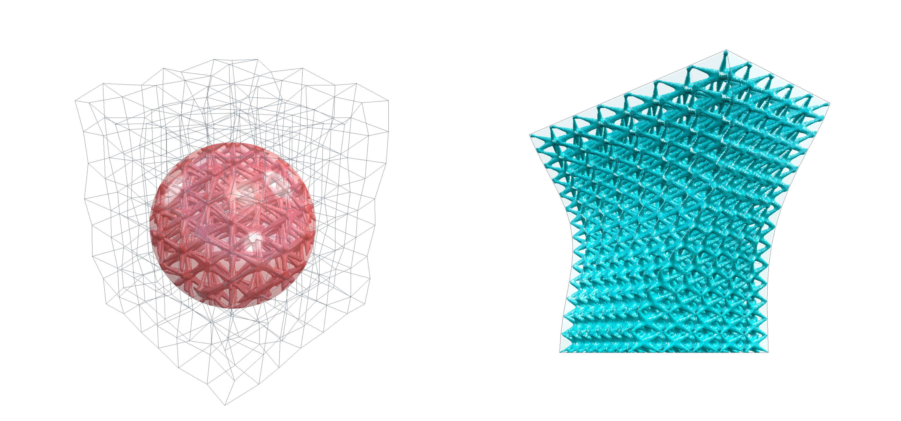

*(1) Viewer output for regular task example. (2) Viewer output for conformal task example.*


In order to get something on your screen, you can modify the PicoGK library instantiation within Program.cs to call one of our example Task functions (either `LatticeLibraryShowCase.RegularTask` or `LatticeLibraryShowCase.ConformalTask` ). The results in the viewer will look like in the image above.

```c#
using Leap71.ShapeKernel;
using Leap71.LatticeLibraryExamples;
using PicoGK;

try
{
    PicoGK.Library.Go(
        0.5f,
        LatticeLibraryShowCase.RegularTask);
}
catch (Exception e)
{
    Console.WriteLine("Failed to run Task.");
    Console.WriteLine(e.ToString());
}
```


## Workflow

PicoGK can be used to render complex lattice structures used for lightweighting infills or porous meta-materials. Most latticing tools are very powerful black-box libraries with many available presets and choices. If, however, you want to tinker around with creating your own custom lattice designs, you can use the workflow that we are presenting here. It is more like a framework, that is very basic to start with and open. Due to its structure it can be easily extended and customized through your own code and gain complexity. The workflow consists of three independent components: an array of cells, a logic to be applied per cell (lattice type) and a spatial beam thickness distribution.

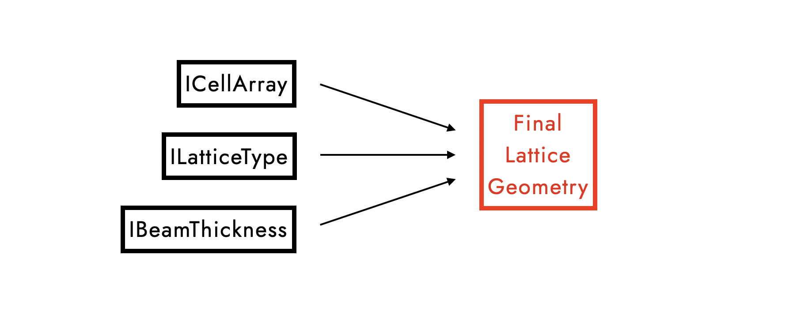

There is no clear order in which these three components need to happen and they can even have different interdependencies. For example, a beam thickness distribution can be applied locally per cell or globally across an entire bounding object that holds many cells. A lattice type can be constant or react to the shape of an individual cell. A cell can change its size according to what the local beam thickness is intended to be... and so on. Many existing workflows are much more constrained, but in order to allow for a maximum of flexibility, we chose to represent each of these three components as interfaces. If you want to customize one of them, you will write a new class that inherits from that interface:

- Interface `ICellArray` provides a list of cells.
- Interface `ILatticeType` provides the logic of how points are derived from the corner points of a cell and connected using straight beams or splines.
- Interface `IBeamThickness` provides the information of what the beam radius for any given point in space should be.

Once you have classes that adhere to these interfaces, you can simply call the function `voxGetFinalLatticeGeometry()` to obtain the final lattice object. How this function looks like is shown at the very end of this documentation. In our case, the function returns the lattice geometry rendered into voxels, so you can apply the PicoGK standard operations such as `Smoothen()`, `Offset()` and all Boolean function to it and eventually mesh it and export it as a print file. 


## Bounding Voxels

Many of the unit cell arrays are periodic and can repeat forever without a distinct start and end point. Therefore, we need to define a box object or a voxelfield to keep the lattice within bounds. For our examples, we are using some of the ShapeKernel BaseShapes and call the resulting voxels `voxBounding`.


```c#
//bounding object
BaseSphere oSphere = new BaseSphere(new LocalFrame(), 50);
Voxels voxBounding = oSphere.voxConstruct();

```


## Unit Cells and Cell Arrays

The common concept of a lattice is that of a regular array that results from repeating the same unit cell (e.g. a cuboid) into every direction to fill the available space. There are a few unit cells that tesselate in 3D, such as cuboids, tetrahedra, prisms from shapes that tesselate in 2D, truncated octahedra... However, the choices are limited and result in rather rigid grids that remind us of crystals. The properties of the selected unit cell will determine the type of grid.


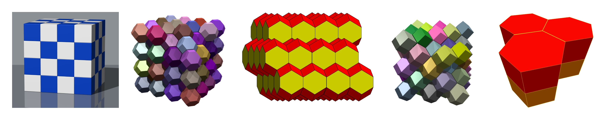

*(1) Tesselating 3D unit cells (every cell is the same) from [Wikipedia](https://en.wikipedia.org/wiki/Wigner%E2%80%93Seitz_cell).*


In order to achieve more flexibility, we want to think about the problem the other way around. The purpose of the `ICellArray` interface is to provide not one, but a list of every cell within the space. Such a class object might then have a list of cells that are not identical, but have some geometric wiggle room. We could add randomness or deformation to our cell array which would allow us to design biomimetic tissues and structures with better vibration dampening. Cells could "wedge" or "mutate" to fit a given space. Think of the bees trying to squish their honeycombs into a corner by slighly deviating from the perfect hexagonal shape whenever they get close to the walls.

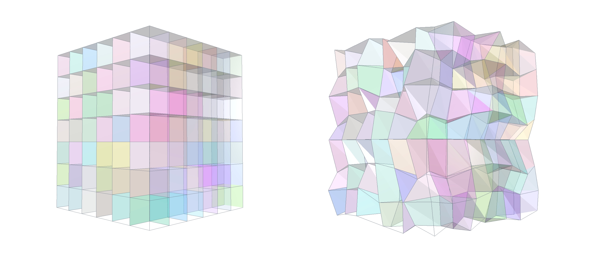

*(1) Individually colored cells within a regular cuboid grid. (2) Individually colored cells within a noisy, regular cuboid grid.*


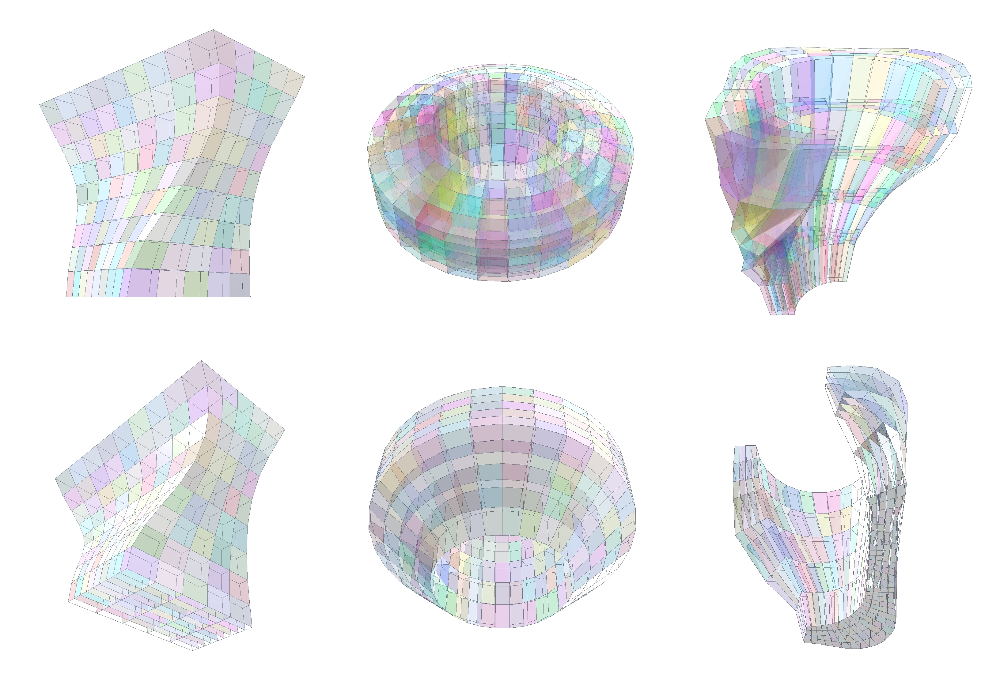

*(1) Individually colored cells within a conformal cuboid grid of a BaseBox object. (2) Individually colored cells within a conformal cuboid grid of a BaseLens object. (3) Individually colored cells within a conformal cuboid grid of a BasePipeSegment object.*


We have three example classes that inherit the interface:

- `RegularUnitCell` generates just a single cell for testing purposes. The cell dimensions in x-, y- and z-direction can be specified and the parameter `fNoiseLevel` can optionally add randomness to the corner vertex positions.
- `RegularCellArray` additionally takes our bounding voxelfield as input and places cells until the bounding box is filled.
- `ConfromalCellArray` takes a BaseShape as input and construct a set number of cells for each dimension that will be surface-conformal. We have implemented this for the BaseBox, BaseLens and BasePipeSegment classes.


## Lattice Types

The second component is something that holds the logic of how additional points and beams need be derived from the given corner points of a unit cell. This is the purpose of the `ILatticeType` interface. There are many standard lattice types catalogued in literature, often derived from crystal or molecule formations.


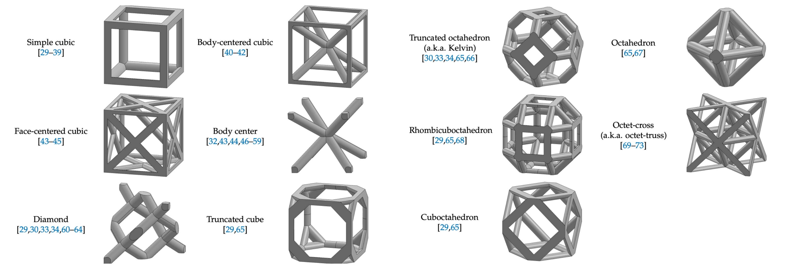

*(1) Some standard lattice type examples from [literature](https://www.researchgate.net/publication/357304334_Design_Optimization_of_Lattice_Structures_under_Compression_Study_of_Unit_Cell_Types_and_Cell_Arrangements).*


Typically, we think of these lattice types as strict rules, that can be hard-coded and will only work on a specific unit cell (e.g. a cuboid cell with eight corner vertices). A standard body-centered lattice type might therefore only support eight corners and will always connect corner 1 with corner 7 (diagonally opposite) and corner 2 with corner 8 and so on. This would work both on a perfectly regular cuboid and a slightely deformed cuboid cell, but there is no alternative construction logic for a wedged cell with only six corner vertices.

Our flexible workflow allows for the creation of smart lattice types that might introduce an element of randomness or apply its own internal decision tree of how to deal with a variety of cell. For instance, if the cell appears to have eight vertices, the preferred connection logic is selected, but if the input is a wedge cell with less vertices, an alternative connection logic is chosen instead, that does not look as pretty, but ensures a stable beam arrangement. 

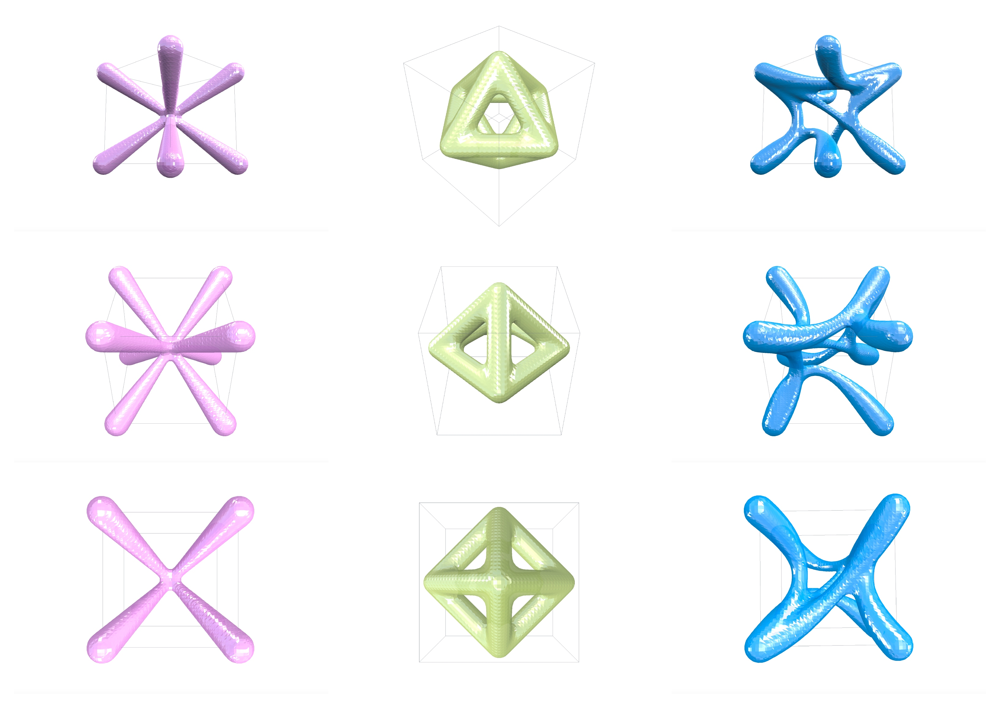

*(1) Body-centered lattice type. (2) Octahedron lattice type. (3) Our cutsom lattice type.*


We have implemented three example classes that inherit the interface:

- `BodyCenteredLattice` from the standard library above.
- `OctahedronLattice` from the standard library above.
- `RandomSplineLattice` is a class to demonstrate a flexible, procedural custom lattice type. It will randomly pick cell corner points and connect them. In addition to that it is spline-based, which means that it does not draw straight beams, but curvy connections as B-splines. This lattice type can deal with any cell with any number of corners and adds an element of randomness while the other two lattice types are much more rigid.

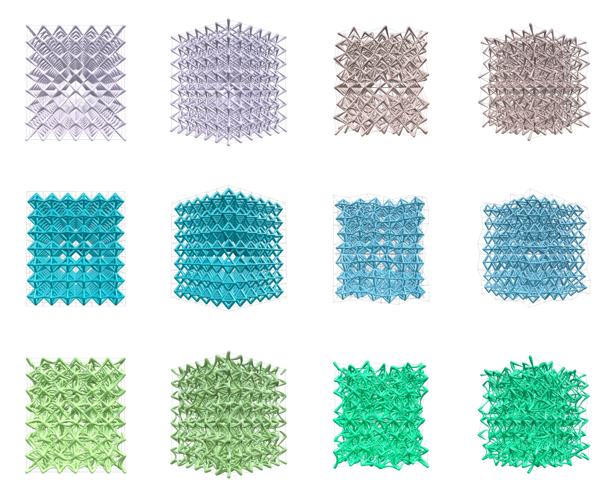

*(1) Body-centered lattice on uniform, regular cuboid grid. (2) Body-centered lattice on noisy, regular cuboid grid. (3) Octahedron lattice on uniform, regular cuboid grid. (4) Octahedron lattice on noisy, regular cuboid grid. (5) Random-spline lattice on uniform, regular cuboid grid. (6) Random-spline lattice on noisy, regular cuboid grid.*


The image below and above show some example combinations of cell arrays and lattice types.

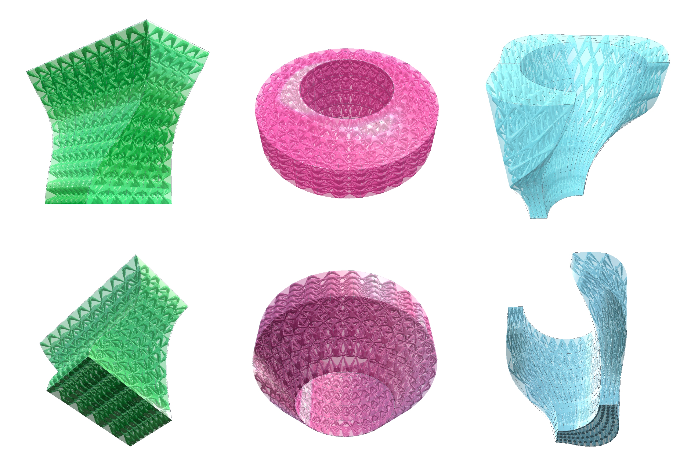

*(1) Body-centered lattice on BaseBox confromal grid. (2) Body-centered lattice on BaseLens conformal grid. (3) Body-centered lattice on BasePipeSegment conformal grid.*


## Beam Thickness Modulations

Lastly, we will need something that tells the thickness of the lattice beams for any given point in space. This is the purpose of the `IBeamThickness` interface and we have four example classes that inherit this interface:

- `ConstantBeamThickness` is a class that always returns a constant value when the interface function is called. This is the most basic and common solution.
- `CellBasedBeamThickness` is a class that gets an update for each unit cell and can access the centre and the corner points of this unit cell. It will figure out the size and will apply a beam thickness gradient locally across each cell.
- `GlobalFuncBeamThickness` is a class that returns a beam thickness value that it calculated from the absolute coordinates of the queried point. This way you can achieve global gradients.
- `BoundaryBeamThickness` is a class that has access to the bounding voxelfield and can query e.g. the distance to the surface for any given point or determine whether a point is inside or outside the object. The resulting beam thickness can have a gradient towards the surface.

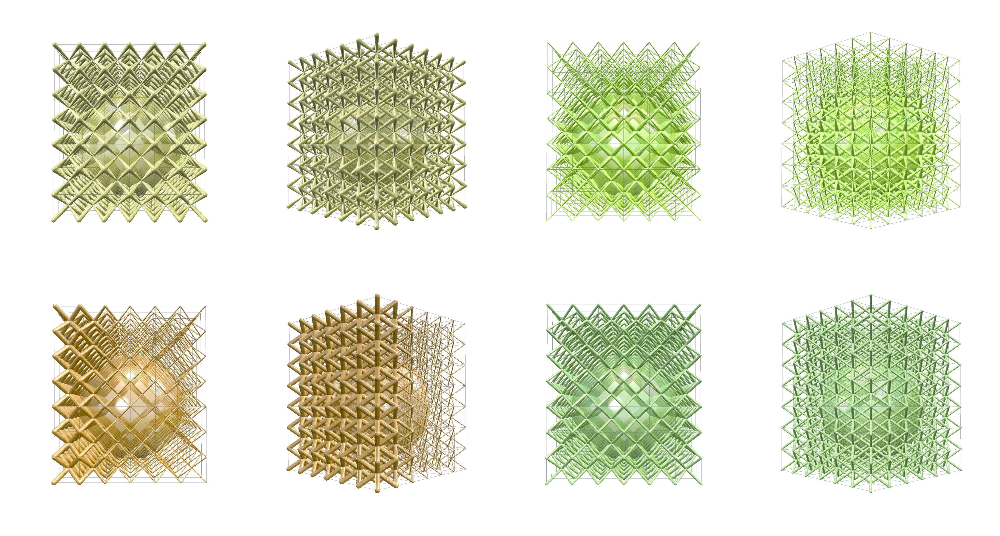

*(1) Cell-based Beam Thickness distribution, the beam become thinner towards the centre of each cell. (2) Bounding-based Beam Thickness distribution, the beams become thicker approaching the surface of the bounding object. (3) Global Beam Thickness distribution, the beams change thickness according to their position along the absolute x-axis. (4) Constant Beam Thickness distribution, the beams have the same thickness everywhere.*


## Workflow

Once you have classes in place to cover the three interfaces, you can simply call `voxGetFinalLatticeGeometry()`, which will apply the connection rules of the lattice type to each of the cells in the array and query the beam thickness distribution for each point of each beam that it draws. The output is the final lattice geometry rendered as voxels. Check out the code of the example Task functions!


```c#
//interfaces
ICellArray xCellArray         = new NoisedRegularCellArray(voxBounding, 20, 20, 20);
ILattice xLatticeType         = new CustomLattice();
IBeamThickness xBeamThickness = new CellBasedBeamThickness(1f, 4f);
xBeamThickness.SetBoundingVoxels(voxBounding);

uint nSubSample    = 5;
Voxels voxLattice  = voxGetFinalLatticeGeometry(
                         xCellArray,
                         xLatticeType,
                         xBeamThickness,
                         nSubSample);
```


Note that the function also takes in a `nSubSample` parameter. Normally a straight beam needs two points, which means that per beam the beam thickness will be queried twice, hence the default `nSubSample = 2`.  As a result, the beam thickness distribution will only have the resolution of your cell grid. If you have an intricate / non-linear beam thickness distribution, you might want to query five times or more per beam in order to resolve the thickness gradient better.


```c#
public Voxels oCreateFinalLatticeGeometry(
  ICellArray xCellArray,
  ILattice xLatticeType,
  IBeamThickness xBeamThickness,
  uint nSubSample = 2)
{
  Lattice oLattice = new Lattice();
  foreach (IUnitCell xCell in xCellArray.aGetUnitCells())
  {
    xBeamThickness.UpdateCell(xCell);
    xLatticeType.AddCell(ref oLattice, xCell, xBeamThickness, nSubSample);
  }
  Voxels voxLattice = new Voxels(oLattice);
  return voxLattice;
}
```


## Post Processing

Once you obtain the final lattice object as a voxelfield, you can intersect it with your bounding voxelfield to make it a proper infill. If you want to smoothen the transitions where the individual beams are glued together, you can use the `Smoothen()` or `OverOffest()` functions. The latter one is interesting because it allows for the closure of smaller loops, partially transitioning your beam-only lattice into a closed-cell tissue. Wether this works well and is desired, depends on the details of your particular lattice type.

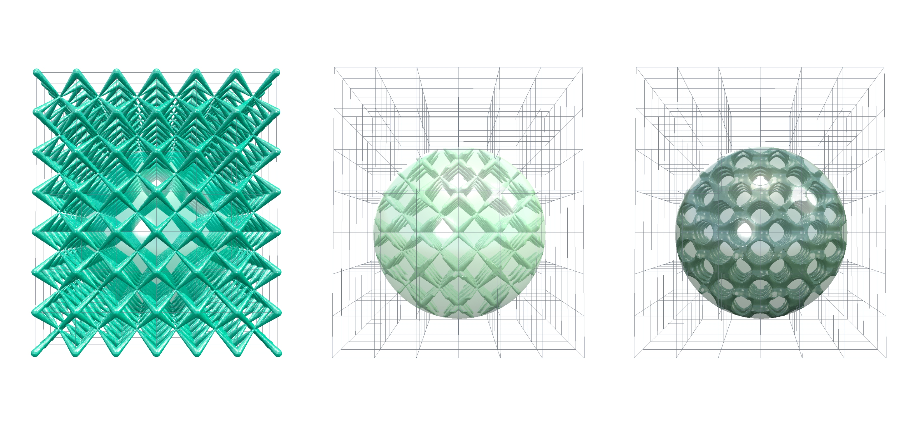

*(1) Post processing options: Raw grid, Intersected with bounding voxels, Intersected with bounding voxels and smoothed corner details.*


```c#
//post-processing
voxLattice = Sh.voxOverOffset(voxLattice, 3f, 0f);
voxLattice = Sh.voxIntersect(voxLattice, voxBounding);

```

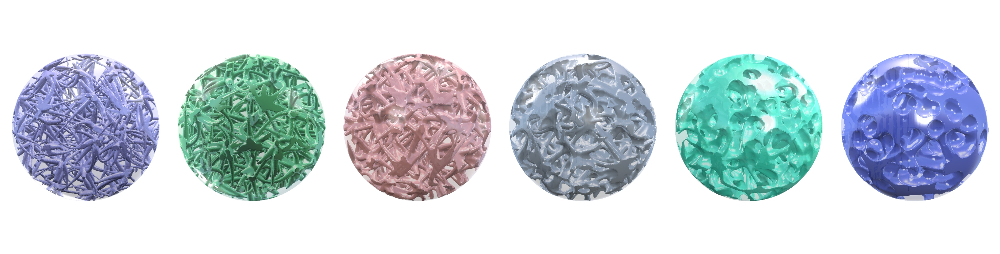

*(1) Sweep of variable over-offsets to a lattice-filled sphere. The larger the initial offset value, the more sharp corner details get removed for smoothly rounded transitions. Offset values from zero to 5 mm from left to right.*


## Next Steps

This initial set of code is meant to show how latticing workflows can be done conceptually in PicoGK and how they may be extended to customize and increase the sophistication of the resulting structures. It should give you a starting point for at least simple, procedural lattices. Feel free to tinker around and contribute to our open-source latticing capabilities! If you want to explore Implicits in PicoGK as well, you can continue with the second part: [Implicit Library](README_ImplicitLibrary.md).