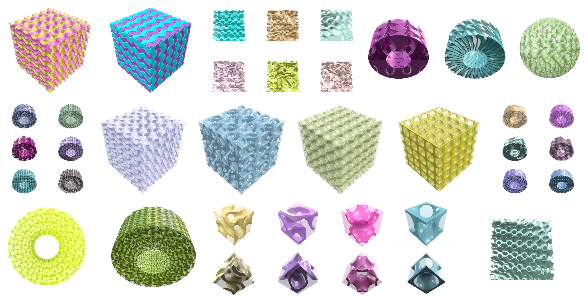
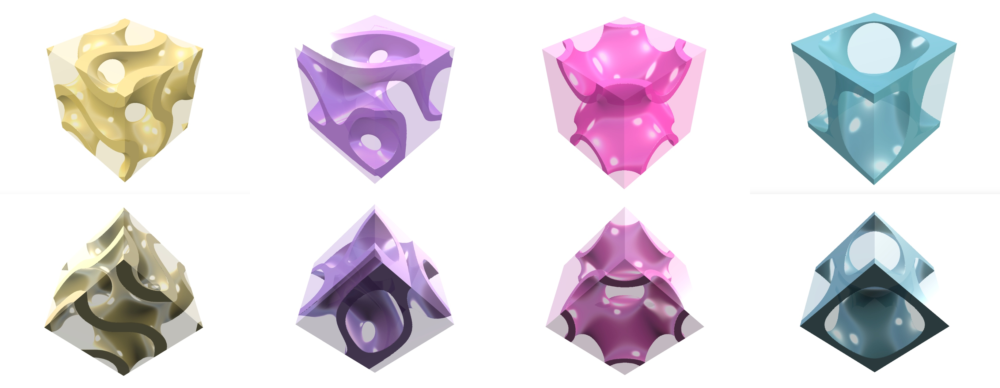
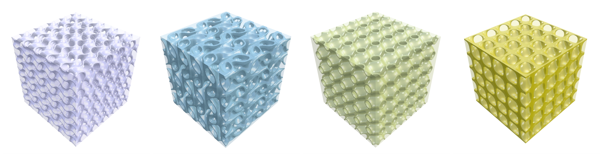
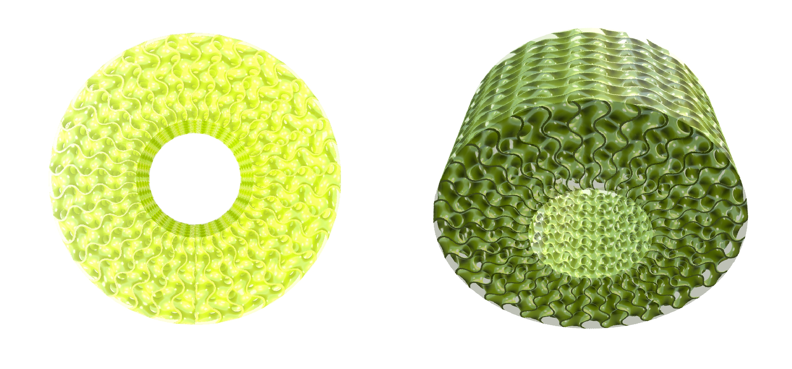
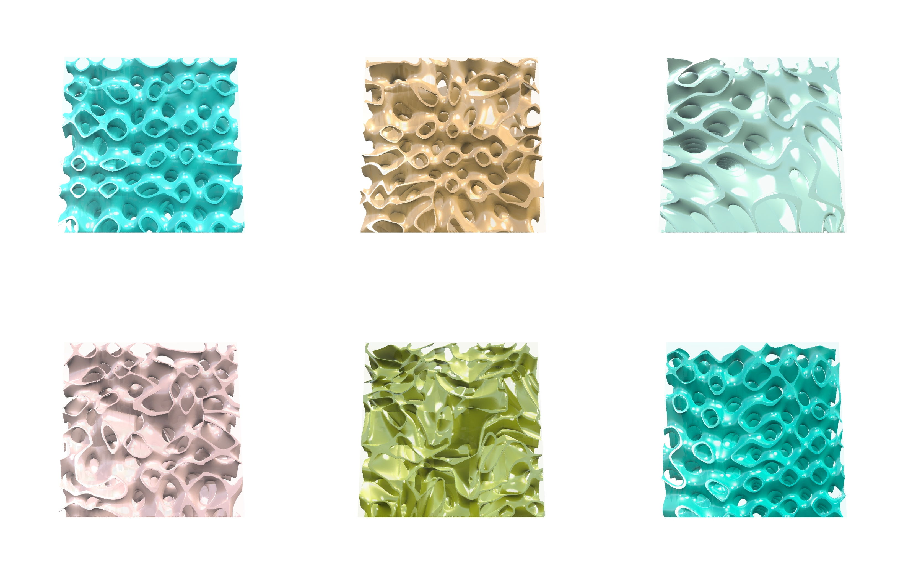
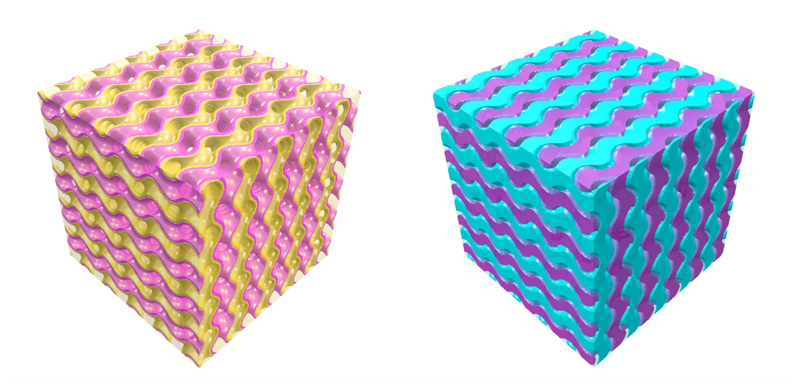
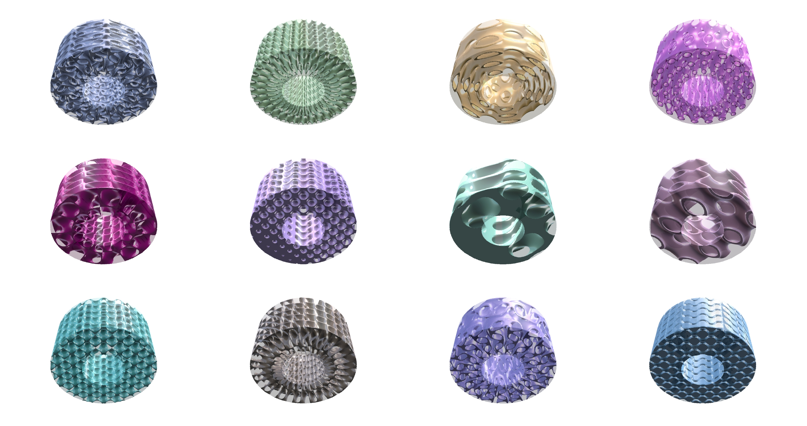
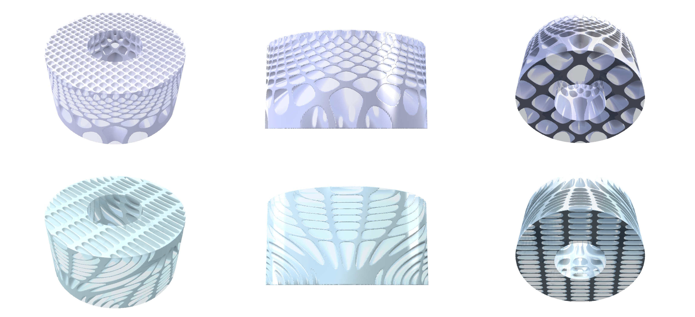
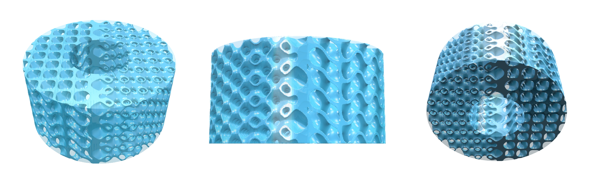

# Implicit Library

## Prep

The Implicit Library is an extension of the LEAP 71 [Lattice Library](README.md). Both belong together from an application point of view as both are commonly used for light-weighting infills and meta-materials. Yet, we are making a distinction between the two as the algorithmic steps and data types involved in their creation are very different.

In PicoGK, lattices are made from beams. Those beams can be explicitly placed in space by defining e.g. their start and end point. The computational overhead of a final lattice object directly depends on the number of beams and the resolution of each beam. Internally, each beam is described as a **signed distance function (SDF or SD Function)** within its small bounding box and then rendered into voxels.

The way we describe gyroids and other TPMS structures is **implicit.** In order to render them into voxels, we need to sample an entire 3D space with a resolution of the voxel size. Keep this in mind if you want to do complex modulations which require querying another object. You will have to do this for many, many more times than when dealing with lattice beams. Instead of using the `Lattice` object, we will be using the `IImplicit` interface. We introduced the basics of this interface in the [ShapeKernel Documentation](https://github.com/leap71/LEAP71_ShapeKernel/blob/main/Documentation/README-ReadingDetails.md). 





## Getting Started

The Implicit Library comes with five example tasks that you can select from and plug into the PicoGK Library instantiation in your Program.cs. Check out the [Lattice Library](README.md) Documentation for a more detailled explanation on this step.

- `ImplicitLibraryShowCase.RegularTask`
- `ImplicitLibraryShowCase.RadialTask`
- `ImplicitLibraryShowCase.RandomTask`
- `ImplicitLibraryShowCase.LogicSplitTask`
- `ImplicitLibraryShowCase.ModularTask`

The first two Task functions will apply one of our TPMS presets to Carthesian and Cylinder coordinates. These are the most popular cases for implicit pattern samples that you see in fields like material testing and bio-printing. The third Task applies a randomized deformation to a TPMS structure while the fourth Task function does not generate one, but two matching implicit patterns at the same time and occupying different logic areas within the "TPMS field". The last Task function holds an attempt to generalize such an implicit workflow similar to the lattice workflow before. Feel free to run these examples before we dive into the details below!


## Bounding Voxels

Implicit patterns are typically periodic, that can repeat forever without a distinct start and end point. Therefore, as with the lattices, we are defining a bounding voxel field. This time it is not optional, but a must. You can create an implicit pattern by calling the function `Sh.voxIntersectImplicit()` which will automatically intersect it with `voxBounding`.


```c#
//bounding object
BaseBox oBox.      = new BaseBox(new LocalFrame(), 50, 50, 50);
Voxels voxBounding = oBox.voxConstruct();
```


## Regular TPMS presets

We have a few commonly used TPMS example classes implemented that inherit the `IImplicit` interface. If you want to create your own implicit pattern, you would instantiate a new class with the interface, similar to our presets, just with an adjusted SD Function.

- `ImplicitGyroid` generates a Gyroid pattern with a custom unit size (same for x-, y- and z-dimension) and constant wall thickness.
- `ImplicitLidinoid` generates a Lidinoid pattern with a custom unit size (same for x-, y- and z-dimension) and constant wall thickness.
- `ImplicitSchwarzPrimitive` generates a Schwarz Primitive pattern with a custom unit size (same for x-, y- and z-dimension) and constant wall thickness.
- `ImplicitSchwarzDiamond` generates a Schwarz Diamond pattern with a custom unit size (same for x-, y- and z-dimension) and constant wall thickness.



*(1)  Units of the regular TPMS presets: Gyroid, Lidinoid, Schwarz Primitive, Schwarz Diamond.*


If you run the `RegularTask` function, you will receive these units applied to a larger box.



*(1) Example viewer outputs for regular task.*


## Radial TPMS presets

Regular TPMS refer to a Carthesian coordinate system. However, a coordinate transformation can be applied before evaluating the SD Function, which will (in this case) result in a radially-aligned TPMS in Cylinder coordinates. Run the `RadialTask`.

- `ImplicitRadialGyroid` generates a gyroid pattern in a radial coordinate system with a custom unit size for the height and radius dimension, specified number of units per circumference and a constant wall thickness.



*(1) Viewer output for radial task.*


You can see how the x- and y-position of the queried point are not directly passed into the SD Function, but translated into values for `fRadius` and polar angle `fPhi` of a cylindrical system.

```c#
public float fSignedDistance(in Vector3 vecPt)
{
  //map carthesian point to cylindrical coordinates
  float fRadius   = VecOperations.fGetRadius(vecPt);
  float fPhi      = VecOperations.fGetPhi(vecPt);
  double dX       = (double)fRadius;
  double dY       = (double)(m_nSamplesPerRound * fPhi);
  double dZ       = vecPt.Z;

  //calculate the gyroid surface equation
  double dDist 	  = Math.Sin(m_fFrequencyScale * dX) *
                    Math.Cos(m_fFrequencyScale * dY) +
                    Math.Sin(m_fFrequencyScale * dY) * 
                    Math.Cos(m_fFrequencyScale * dZ) +
                    Math.Sin(m_fFrequencyScale * dZ) * 
                    Math.Cos(m_fFrequencyScale * dX);

  //apply thickness to the gyroid surface
  return (float)(Math.Abs(dDist) - 0.5f * m_fWallThickness);
}
```


## Randomized TPMS presets

In addition to the regular TPMS presets, you will find a variant that can handle deformation on a grid level when running the `RandomTask`:

- `ImplicitRandomizedSchwarzPrimitive` generates a schwarz primitive pattern with a constant wall thickness and a custom unit size (same for x-, y- and z-dimension) that gets deformed by a `RandomDeformationField.`



*(1)  Randomized variants of a schwarz primitive TPMS with different deformation amplitude and deformation grid size.*


Applying randomness to an implicit pattern is not straightforward. Using lattices, we can simply add randomness / deformation to the corner points of the cell array. If we were to apply randomness to each voxel that is sampled for the implicit, we would have a very fine-grained noise on the voxel-level rather than on the grid level. In order to achieve consistency across a larger spatial dimension, we have implemented a `RandomDeformationField`, that stores random deformations in a coarse regular grid (similar to our lattice cell array).

This field object can return a deformation vector for each point in space that is derived from tri-linear interpolation from its coarse grid. This external field object could be modified to hold experimental or simulation data or other 3D spatial distributions that can not easily expressed in a global analytical function. 


## Splitting Logic

Strictly speaking, a "native" Gyroid (or other TPMS) are described by a  **signed distance field (SDF or SD Field)** from which no volumetric object could be derived as the wall thickness would be Zero. Therefore, the SD Fuctions that we use includes some sort of threshold / shift with respect to the zero-surface that we parametrize as wall thickness. This means that you can apply different `Min()`, `Max()`, `Abs()` and threshold functions to the SD Field and your resulting geometry will occupy different areas. By playing with the logic split of those regions, e.g. we can obtain two volumes that represent alternating void or alternating split walls. Run the `LogicSplitTask`:



*(1) Example viewer outputs for logic split task.*


The code snippets below show the different splitting logics for the "positive" and the "negative" sides. Note that the distinction between walls and voids only make sense when the wall thickness is much smaller than the unit size.

```c#
//positive void
float fFinalSD = (float)(Math.Max(0, fRawSD) - 0.5f * fWallThickness);
return -fFinalSD;
                
//negative void
float fFinalSD = (float)(Math.Max(0, -fRawSD) - 0.5f * fWallThickness);
return -fFinalSD;

//positive wall
float fFinalSD = (float)(Math.Max(fRawSD, Math.Abs(fRawSD) - 0.5f * fWallThickness));
return fFinalSD;
               
//negative wall
float fFinalSD = (float)(Math.Max(-fRawSD, (Math.Abs(fRawSD) - 0.5f * fWallThickness)));
return fFinalSD;
```


## Modular Workflow

The last Task function (`ModularTask`) holds an attempt to generalize such an implicit workflow similar to the lattice workflow before. So far in this tutorial, we are using `IImplicit` classes that combine everything that is needed for the generation of an implicit shape. Now, we are splitting it up and multiple interfaces are combined to carry the individual components separately and  allow for easy mix-and-match pattern combinations. The image below shows some of the variations that can be created. Our new interfaces are:

- `IRawTPMSPattern` returns a normalized SD Field without unit size scaling, wall thicknesses, coordinate transformations or splitting logic applied.
- `ISplittingLogic` holds the threshold logic to obtain the various regions within a SD Field (similar to the code snippets above).
- `ICoordinateTrafo` maps one 3D point (that usually comes from a Carthesian coordinate system) onto another 3D point (e.g. in a cylindrical system)
- `IBeamThickness` returns the wall thickness for a point in space. We are recycling this interface from the Lattice Library as it serves the same task. 



*(1) Example viewer outputs for modular task.*


Note that some of the variants feature wall thickness gradients. Similarly, other parameters can be steered by a functional dependency rather than just a constant value. Below, you see examples for a unit size modulation using the `FunctionalScaleTrafo` class from the `ICoordinateTrafo` interface. 



*(1) Unit size modulation with small units towards the top and larger units towards the bottom of the cylinder.*

*(2) Unit size modulation with x-stretched units towards the top and y-stretched units towards the bottom of the cylinder.*


As a last example, you can even interpolate between different TMPS types in a spatial way using the `RawTransitionTPMSPattern` class from the `IRawTPMSPattern` interface. The image below shows a smooth transition from a Schwarz Primitive to a Schwarz Diamond cell.




## Next Steps

If you want to understand how implicits work, it is best to start creating your own `IImplicit` classes similar to our TPMS presets. While we use implicits mainly for infill patterns and interior structures, Inigo Quilez describes a number of examples for BaseShape-like geometries that can be generated from SDF formulas as well as operations (such as Booleans and Offset functions) from combined SDFs.

- https://iquilezles.org/articles/distfunctions/